# Database schema (current through Milestone 12B.1D)

PostgreSQL via SQLAlchemy 2.0. JSON payloads use JSONB on PostgreSQL and JSON on the SQLite test database. Tests do not use JSONB operators.

Authentication is **not** implemented. Every business table is scoped by `organization_id` (directly or through a parent row). Local/dev uses `DEFAULT_ORGANIZATION_ID`.

Amazon connection tables are **authorization metadata**. They must never store refresh tokens, access tokens, LWA secrets, or authorization codes. Canonical seller-account / marketplace identity tables are **not created yet** (12B.2).

Current Alembic head: `0008_amazon_oauth_states`. Chain: `0001_m10_persistence` → `0002_scoring_profiles` → `0003_report_lifecycle` → `0004_copilot_conversations` → `0005_profit_models` → `0006_advertising_models` → `0007_amazon_connections` → `0008_amazon_oauth_states`.

Standard V2 scoring weights are a **code constant** (`standard-v2`), not a `scoring_profiles` row. One active custom default per organization is enforced in the service layer (SQLite-friendly; no PostgreSQL partial unique index).

## ER diagram

```mermaid
erDiagram
  organizations ||--o{ product_snapshots : owns
  organizations ||--o{ analysis_runs : owns
  organizations ||--o{ scoring_profiles : owns
  organizations ||--o{ report_uploads : owns
  organizations ||--o{ bulk_jobs : owns
  organizations ||--o{ generated_reports : owns
  organizations ||--o{ usage_events : owns
  organizations ||--o{ profit_models : owns
  organizations ||--o{ advertising_models : owns
  organizations ||--o{ amazon_connections : amazon_auth
  organizations ||--o{ amazon_oauth_states : oauth_txn
  amazon_connections ||--o{ amazon_oauth_states : states
  profit_models ||--o{ profit_snapshots : snapshots
  profit_models ||--o| advertising_models : advertising
  advertising_models ||--o{ advertising_snapshots : snapshots
  product_snapshots ||--o{ analysis_runs : snapshot
  analysis_runs ||--o| listing_analysis_results : listing_v2
  analysis_runs ||--o| ai_listing_results : ai_v2
  analysis_runs ||--o| image_intelligence_results : image
  analysis_runs ||--o{ generated_reports : optional
  report_uploads ||--o{ bulk_jobs : input
  bulk_jobs ||--o{ bulk_job_items : items
  bulk_jobs ||--o{ generated_reports : excel
  product_snapshots ||--o{ bulk_job_items : optional

  organizations {
    uuid id PK
    string name
    datetime created_at
    datetime updated_at
  }

  scoring_profiles {
    uuid id PK
    uuid organization_id FK
    string name
    string description
    numeric title_weight
    numeric bullets_weight
    numeric description_a_plus_weight
    numeric media_weight
    numeric content_structure_weight
    bool is_default
    datetime archived_at
    datetime created_at
    datetime updated_at
  }

  product_snapshots {
    uuid id PK
    uuid organization_id FK
    string asin
    string marketplace
    string source
    jsonb normalized_product
    string content_hash
    datetime fetched_at
    datetime created_at
  }

  analysis_runs {
    uuid id PK
    uuid organization_id FK
    uuid product_snapshot_id FK
    string asin
    string marketplace
    string status
    string listing_score_version
    string ai_prompt_version
    string image_prompt_version
    string product_source
    string display_name
    jsonb metadata
    datetime started_at
    datetime completed_at
    datetime deleted_at
    datetime created_at
    datetime updated_at
  }

  listing_analysis_results {
    uuid id PK
    uuid analysis_run_id FK
    string score_version
    int listing_quality_score
    int custom_listing_quality_score
    jsonb scoring_profile_snapshot
    jsonb payload
    datetime created_at
  }

  ai_listing_results {
    uuid id PK
    uuid analysis_run_id FK
    string provider
    string model
    string prompt_version
    jsonb payload
    int input_tokens
    int output_tokens
    int total_tokens
    float estimated_cost_usd
    int latency_ms
    datetime created_at
  }

  image_intelligence_results {
    uuid id PK
    uuid analysis_run_id FK
    string provider
    string model
    string prompt_version
    jsonb payload
    int images_available
    int images_selected
    int images_skipped
    int input_tokens
    int output_tokens
    int total_tokens
    float estimated_cost_usd
    int latency_ms
    datetime created_at
  }

  report_uploads {
    uuid id PK
    uuid organization_id FK
    string report_type
    string original_filename
    string storage_bucket
    string storage_path
    string file_hash
    string parser_version
    int row_count
    string status
    uuid duplicate_of_id
    jsonb analysis_payload
    datetime uploaded_at
    datetime created_at
  }

  bulk_jobs {
    uuid id PK
    uuid organization_id FK
    string status
    uuid input_file_id FK
    string external_job_id
    int total_items
    int processed_items
    int successful_items
    int failed_items
    jsonb settings
    datetime created_at
    datetime completed_at
  }

  bulk_job_items {
    uuid id PK
    uuid bulk_job_id FK
    string asin
    string status
    uuid product_snapshot_id FK
    jsonb listing_analysis
    string error
    datetime created_at
  }

  generated_reports {
    uuid id PK
    uuid organization_id FK
    uuid analysis_run_id FK
    uuid bulk_job_id FK
    string report_type
    string storage_bucket
    string storage_path
    string filename
    string template_version
    datetime created_at
  }

  usage_events {
    uuid id PK
    uuid organization_id FK
    string provider
    string workflow
    string event_type
    string model
    int input_tokens
    int output_tokens
    int total_tokens
    float estimated_cost_usd
    bool cache_hit
    int latency_ms
    datetime created_at
  }

  profit_models {
    uuid id PK
    uuid organization_id FK
    string asin
    string marketplace
    string currency
    numeric selling_price
    string selling_price_source
    numeric cogs
    numeric shipping_cost
    numeric packaging_cost
    numeric other_cost
    numeric referral_fee_amount
    numeric fba_fee_amount
    string fee_category_key
    datetime created_at
    datetime updated_at
  }

  profit_snapshots {
    uuid id PK
    uuid organization_id FK
    uuid profit_model_id FK
    string status
    string profit_formula_version
    jsonb inputs_json
    jsonb outputs_json
    jsonb completeness
    datetime calculated_at
  }

  advertising_models {
    uuid id PK
    uuid organization_id FK
    uuid profit_model_id FK
    string asin
    string marketplace
    string currency
    date period_start
    date period_end
    numeric ad_spend
    numeric ad_sales
    numeric total_sales
    numeric units_in_period
    string source
    datetime created_at
    datetime updated_at
  }

  advertising_snapshots {
    uuid id PK
    uuid organization_id FK
    uuid advertising_model_id FK
    uuid profit_model_id FK
    string status
    string ads_formula_version
    jsonb inputs_json
    jsonb outputs_json
    jsonb completeness_json
    jsonb impact_json
    uuid profit_snapshot_id
    datetime calculated_at
  }

  amazon_connections {
    uuid id PK
    uuid organization_id FK
    string provider
    string environment
    string region
    string status
    string selling_partner_id
    string application_id
    string token_reference
    datetime authorized_at
    datetime last_successful_validation_at
    datetime last_successful_sync_at
    datetime last_error_at
    string last_error_code
    datetime created_at
    datetime updated_at
  }

  amazon_oauth_states {
    uuid id PK
    uuid organization_id FK
    uuid connection_id FK
    string provider
    string environment
    string state_hash
    string amazon_state
    datetime expires_at
    datetime consumed_at
    datetime created_at
  }
```

`analysis_runs.id` is the public `report_id`.

Product snapshots are **append-only**. The same ASIN can have many snapshots (20 Aug, 3 Sep, 20 Sep) so future listing-score history can compare them. Do not overwrite a single ASIN row.

## Indexes (Milestone 10)

- `product_snapshots (organization_id, asin, fetched_at)`
- `analysis_runs (organization_id, asin, created_at)`
- `analysis_runs (organization_id, created_at)`
- `analysis_runs (organization_id, deleted_at)`
- `scoring_profiles (organization_id)`
- `usage_events (organization_id, created_at)`
- `report_uploads (organization_id, file_hash)`
- `generated_reports (analysis_run_id, report_type, template_version)`
- `profit_models (organization_id, asin, marketplace)` unique
- `profit_snapshots (organization_id, profit_model_id, calculated_at)`
- `advertising_models (profit_model_id)` unique
- `advertising_models (organization_id, profit_model_id)`
- `advertising_snapshots (organization_id, advertising_model_id, calculated_at)`
- `amazon_connections (organization_id, provider, environment)` unique
- `amazon_connections (organization_id)`
- `amazon_oauth_states (state_hash)` unique
- `amazon_oauth_states (organization_id)`
- `amazon_oauth_states (connection_id)`
- `amazon_oauth_states (expires_at)`

`amazon_connections.token_reference` is an opaque SecretProvider pointer (`asi/amazon/...`). It is not a refresh token. Status values: `not_connected`, `pending_authorization`, `pending_validation`, `connected`, `degraded`, `revoked`, `error`. `connected` means authorization validated, not that seller business data has been ingested.

## Future tables (not created)

- Canonical `amazon_seller_accounts` / `amazon_marketplaces` (12B.2)
- Seller listings / orders / inventory / reports / finances (12B.3+)
- `users` / auth identity mapping
- `organization_memberships`
- RLS policies keyed on authenticated `organization_id`
- Dedicated listing-score time-series table (snapshots + listing results are enough to start)

## Storage buckets (not SQL)

Private Supabase buckets:

- `seller-report-uploads` — original CSV/XLSX
- `generated-reports` — bulk Excel output and client analysis PDFs (`analysis_pdf` / `analysis-report-v1`)

File bytes are not stored in PostgreSQL. SHA-256 is stored on `report_uploads.file_hash` for duplicate identification (duplicates are stored and flagged, not rejected).
