# Milestone 11 — Architecture Review

**Date:** 21 August 2026  
**Scope:** Review of the system as implemented after Milestone 10C.1. Written as planning. **11A (tool layer) is now implemented** — see [copilot-tool-layer.md](copilot-tool-layer.md). 11B–11E remain FUTURE.  
**API version in code:** FastAPI `app.version = 0.16.0` (`apps/api/app/main.py`). `pyproject.toml` still says `0.1.0`.

This document describes the **current** architecture, then the recommended Copilot / workspace architecture. Planned features are marked FUTURE. They are not claimed as implemented.

---

## 1. Executive Summary

Amazon Seller Intelligence is a local FastAPI + Next.js monorepo that already behaves like a **tool-oriented intelligence platform**, not a chatbot.

The core pattern is already correct for Copilot:

1. Normalize Amazon observations into `Product`.
2. Run **deterministic** analytics (listing V2, PPC, business, competitor comparison).
3. Optionally call **OpenAI** for structured interpretation (listing AI V2, image intelligence, competitive AI).
4. Persist historical listing/AI/image reports under `organization_id`.
5. Reopen and export those reports with **zero** Rainforest and OpenAI calls.

**Architecture health: GOOD WITH CHANGES.** The service boundaries, provider abstractions, and “deterministic scores are authoritative” philosophy are strong enough to host a Seller Copilot. Milestone 11 should **wrap** existing services as tools and add conversation + workspace persistence. It should not rewrite the analyzer, providers, or History.

There is **no authentication**. Tenant isolation is a column + `DEFAULT_ORGANIZATION_ID`. That is acceptable for Copilot V1 on a single development organization. It is **not** acceptable for multi-user production Copilot.

**RAG should not be Copilot V1.** Profit modeling should be the first interactive workspace. SP-API, Ads API, image generation, MCP, Claude, Redis, and Celery should wait.

---

## 2. Current Architecture

### 2.1 Runtime shape

| Layer | Implementation |
| --- | --- |
| Frontend | Next.js App Router (`apps/web`), four routes |
| API | FastAPI (`apps/api`), prefix `/api/v1` |
| Process | Single API process. Bulk jobs run **in-process** (`InProcessJobBackend`) |
| Cache | In-memory TTL (`MemoryTtlCache` / `MemoryTtlValueCache`) |
| Database | PostgreSQL via SQLAlchemy 2.0 when `DATABASE_URL` is set; SQLite in pytest |
| Files | Private Supabase Storage buckets, or `MemoryFileStore` in tests |
| Tenant | `organizations` row + `current_organization_id()` from settings. No users, no JWT |

### 2.2 Request path (implemented)

```text
Next.js (apps/web)
  lib/api.ts  →  HTTP JSON / multipart
        ↓
FastAPI routes  (products, analysis, scoring-profiles, competitors,
                 reports, usage, bulk)
        ↓
Application services
  ProductService
  ListingAnalysisService (V1)
  ListingAnalysisV2Service
  ScoringProfileService
  AIListingIntelligenceService (V1)
  AIListingIntelligenceV2Service
  AIImageIntelligenceService
  CompetitorSearchQueryService / CompetitorDiscoveryService
  CompetitorComparisonService
  AICompetitiveIntelligenceService
  ReportAnalysisService
  AnalysisHistoryService
  ClientReportService
  ArtifactPersistenceService
  UsageDashboardService
  Bulk job processor
        ↓
Deterministic analytics          Structured AI
  listing_rules / listing_rules_v2   prompts/* + AIProvider
  scoring_profiles
  competitor_rules / relevance
  ppc_rules / business_report_rules
        ↓
Provider abstractions
  ProductDataProvider
  AmazonSearchProvider
  AIProvider
  FileStore
        ↓
Rainforest API                   OpenAI Chat Completions
Amazon.in public HTML (optional) Supabase PostgreSQL + Storage
Mock catalog                     In-memory ledger + usage_events
```

### 2.3 What is actually persisted vs session-only

| Capability | Persisted today? |
| --- | --- |
| Listing Intelligence V2 + optional custom score snapshot | Yes (`analysis_runs` + `listing_analysis_results`) |
| AI Listing V2 | Yes (`ai_listing_results`), attach to same report |
| Image Intelligence | Yes (`image_intelligence_results`) |
| Product snapshot at analysis time | Yes (`product_snapshots`, immutable) |
| Client PDF | Yes (`generated_reports` + Storage) |
| Scoring profiles | Yes (`scoring_profiles`) |
| Seller report **file** + analysis JSON | Yes (`report_uploads` + Storage) when persistence is on |
| Bulk job metadata / items / Excel | Dual-written when persistence is on; **runtime** is still in-process memory |
| Listing V1 analysis | No |
| AI Listing V1 | No |
| Competitor discovery / comparison / competitive AI | No |
| Usage dashboard (process ledger) | In-memory; **also** dual-written to `usage_events` when DB is on |
| Copilot conversations | No |
| Profit models | No |
| Knowledge documents | No |

### 2.4 Frontend (actual navigation)

From `apps/web/src/components/app-shell.tsx`:

| Nav id | Route | Label |
| --- | --- | --- |
| `asin` | `/` | Analyze |
| `history` | `/history`, `/history/[id]` | History |
| `reports` | `/reports` | Seller Reports |
| `bulk` | `/bulk` | Bulk Due Diligence |

There is **no Copilot route**. Analyze is a single page (`ProductLookup`) that hosts listing V2, custom weights, AI V2, image AI, competitor discovery/comparison, and manual entry.

API Budget lives in the header (`UsagePanel`), not as its own nav item.

### 2.5 Documentation vs code (discrepancies)

Inspected code, then compared with `README.md`, `docs/changes.md`, and service docstrings.

| Claim | Reality |
| --- | --- |
| README item 9: Seller report analytics has **“No database”** | `POST /api/v1/reports/analyze` **does** call `ArtifactPersistenceService.save_seller_report_upload` and stores SHA-256, file bytes, and `analysis_payload` when `DATABASE_URL` is set |
| `ReportAnalysisService` module docstring: **“No AI. No persistence.”** | Analytics service itself does not persist. The **route** persists. The docstring is stale |
| `docs/changes.md` Milestone 10C PDF template `analysis-report-v1` | Historically true for 10C. Current generator is `analysis-report-v2` (`REPORT_TEMPLATE_VERSION`) |
| `pyproject.toml` version `0.1.0` | FastAPI app advertises `0.16.0` |
| `ProductService` comment: “Later it can add caching, persistence” | Product **lookup** is not written to `product_snapshots` until listing V2 is recorded. Rainforest/public providers already cache in memory |
| README: bulk is mock-only | True by default (`BULK_LIVE_PROVIDER_CALLS_ENABLED=false`). Live path exists but is forbidden unless that flag is set |
| Competitor comparison uses listing quality | Uses **Listing Intelligence V1** (`ListingAnalysisService`), not V2. Documented in README; easy to miss in Copilot design |
| Search provider | `get_search_provider()` returns mock only when `product_provider == mock`; otherwise Rainforest search. There is no `amazon_public` search provider |

These are documentation/comment drifts, not missing product features.

---

## 3. Architecture Diagram

```mermaid
flowchart TB
  subgraph FE["Frontend — IMPLEMENTED"]
    Analyze["/ Analyze"]
    History["/history"]
    Reports["/reports"]
    Bulk["/bulk"]
    Budget["API Budget header"]
  end

  subgraph API["FastAPI routes — IMPLEMENTED"]
    RProd["/products"]
    RAn["/analysis"]
    RScore["/scoring-profiles"]
    RComp["/competitors"]
    RRep["/reports"]
    RUse["/usage"]
    RBulk["/bulk"]
  end

  subgraph SVC["Application services"]
    PS[ProductService]
    L1[ListingAnalysisService V1 LEGACY]
    L2[ListingAnalysisV2Service]
    SP[ScoringProfileService]
    AI1[AIListingIntelligenceService V1 LEGACY]
    AI2[AIListingIntelligenceV2Service]
    IMG[AIImageIntelligenceService]
    CCD[CompetitorDiscoveryService]
    CCC[CompetitorComparisonService]
    ACI[AICompetitiveIntelligenceService]
    RAS[ReportAnalysisService]
    AHS[AnalysisHistoryService]
    CRS[ClientReportService]
    APS[ArtifactPersistenceService]
  end

  subgraph DET["Deterministic analytics"]
    RulesV2[listing_rules_v2]
    RulesV1[listing_rules v1]
    PPC[ppc_rules]
    BUS[business_report_rules]
    CR[competitor_rules]
  end

  subgraph ABS["Provider abstractions"]
    PDP[ProductDataProvider]
    ASP[AmazonSearchProvider]
    AIP[AIProvider]
    FS[FileStore]
  end

  subgraph EXT["External / storage"]
    RF[Rainforest]
    OA[OpenAI]
    PUB["amazon_public HTML EXPERIMENTAL"]
    PG[(PostgreSQL)]
    ST[(Private Storage)]
  end

  Analyze --> RProd & RAn & RScore & RComp
  History --> RRep
  Reports --> RRep
  Bulk --> RBulk
  Budget --> RUse

  RProd --> PS
  RAn --> L1 & L2 & SP & AI1 & AI2 & IMG & CCC & ACI
  RComp --> CCD
  RRep --> RAS & AHS & CRS
  RBulk --> APS

  L2 --> RulesV2
  L1 --> RulesV1
  CCC --> RulesV1
  RAS --> PPC & BUS
  CCD --> CR

  PS --> PDP
  CCD --> ASP
  AI1 & AI2 & IMG & ACI --> AIP
  APS & CRS --> FS
  AHS --> PG

  PDP --> RF
  PDP -.-> PUB
  ASP --> RF
  AIP --> OA
  FS --> ST
  APS --> PG
```



### Cross-cutting concerns (as built)

| Concern | Implementation | Status |
| --- | --- | --- |
| Persistence | SQLAlchemy + Alembic migrations `0001`–`0003`; optional if `DATABASE_URL` empty | IMPLEMENTED |
| Caching | Process-local TTL for products, search, AI, account usage | IMPLEMENTED (not Redis) |
| Tenant scoping | `organization_id` on business tables; `current_organization_id()` = settings UUID | IMPLEMENTED foundation / FUTURE auth |
| Usage tracking | `ApplicationUsageLedger` + optional `usage_events` | IMPLEMENTED |
| Error handling | Domain exceptions → HTTP 400/401/404/429/502 in routes | IMPLEMENTED |
| Provenance | `meta.source` on product/analysis responses; snapshot `source`; PDF metadata | IMPLEMENTED for listing History |
| Prompts | Versioned Python modules under `app/prompts/` | IMPLEMENTED |
| Provider abstraction | Product, search, AI, FileStore | IMPLEMENTED |

---

## 4. Implemented Capability Inventory

Legend: **IMPLEMENTED** = live in this repo. **LEGACY** = still callable, not the primary UI path. **EXPERIMENTAL** = present, not the default production path. **FUTURE** = not built.

### 4.1 Product intake

| Capability | Status | Notes |
| --- | --- | --- |
| Rainforest `type=product` | IMPLEMENTED | Default `PRODUCT_PROVIDER=rainforest` |
| Mock ASINs `B0TEST0001`–`B0TEST0003` | IMPLEMENTED | Always checked first in `ProductService.fetch_product` |
| Manual product POST | IMPLEMENTED | Same `Product` model |
| Amazon.in public HTML scrape | EXPERIMENTAL | `PRODUCT_PROVIDER=amazon_public`; fragile; not Copilot-default |
| SP-API catalog | FUTURE | Abstraction exists so it can replace Rainforest later |

### 4.2 Listing intelligence

| Capability | Status | Provider cost |
| --- | --- | --- |
| Listing V2 score + market signals + coverage | IMPLEMENTED | 0 |
| Custom scoring profiles (aggregate only) | IMPLEMENTED | 0 |
| Persist V2 report | IMPLEMENTED | 0 |
| Listing V1 score | LEGACY | 0; still used by competitor comparison |
| AI Listing V2 | IMPLEMENTED | OpenAI, explicit click |
| AI Listing V1 | LEGACY | OpenAI |
| Image & Media Intelligence | IMPLEMENTED | OpenAI multimodal, explicit click, allowlisted image URLs |
| Client PDF `analysis-report-v2` | IMPLEMENTED | 0 providers; historical data only |
| Soft-delete History | IMPLEMENTED | Sets `deleted_at` |

### 4.3 Competitive

| Capability | Status | Provider cost |
| --- | --- | --- |
| Deterministic search-query builder | IMPLEMENTED | 0 |
| Rainforest Amazon search discovery | IMPLEMENTED | 1 search credit per discover |
| Compare up to 3 ASINs | IMPLEMENTED | 1 product credit per competitor miss/cache miss |
| Competitive AI | IMPLEMENTED | OpenAI |
| Persist comparison as a History report | FUTURE | Not stored as `analysis_runs` |

### 4.4 Seller Central files

| Capability | Status | Provider cost |
| --- | --- | --- |
| Search Term Report → PPC analytics | IMPLEMENTED | 0 AI |
| Business Report analytics | IMPLEMENTED | 0 AI |
| File persist + duplicate hash | IMPLEMENTED | Storage |
| AI interpretation of PPC | FUTURE | |
| History UI for uploads | FUTURE | Analytics shown on Seller Reports page only |

### 4.5 Bulk

| Capability | Status |
| --- | --- |
| CSV/XLSX ingest, in-process job, Excel export | IMPLEMENTED |
| Mock catalog + mock AI (default) | IMPLEMENTED |
| Live Rainforest/OpenAI in bulk | EXPERIMENTAL / gated off |

### 4.6 Platform

| Capability | Status |
| --- | --- |
| API Budget (Rainforest account + OpenAI spend vs app ledger) | IMPLEMENTED |
| Auth / multi-user | FUTURE |
| Copilot | FUTURE |
| Profit model | FUTURE |
| RAG | FUTURE |
| Historical ASIN-vs-ASIN analysis diff | FUTURE (data exists for listing V2; no API) |
| Keyword volume / SQP | FUTURE |
| Redis / Celery | FUTURE |

---

## 5. Architecture Strengths

1. **Provider isolation is real.** Routes do not import Rainforest HTTP. `ProductDataProvider` and `AmazonSearchProvider` are the swap points for SP-API later.
2. **Deterministic vs AI is enforced in prompts and services.** Scores, PPC metrics, and comparison gaps are computed in Python. AI receives them as evidence and is told not to recalculate.
3. **Normalized `Product` is the lingua franca.** Manual, mock, Rainforest, and public HTML all produce the same object.
4. **Listing V2 already separates listing quality, market signals, and data coverage.** That maps directly to Copilot provenance (observed vs unknown vs calculated).
5. **History is immutable snapshots.** Reopen/PDF/delete do not refetch Amazon or regenerate AI. That is the correct model for “what happened to this ASIN vs last time.”
6. **Explicit-click AI.** Listing AI, image AI, and competitive AI are not implicit on lookup. Copilot must preserve that for expensive tools.
7. **Test surface is serious.** Pytest covers providers (mocked), listing V1/V2, AI schemas, reports, bulk, persistence, PDF, scoring. No live provider calls in automated tests (`conftest` forces mock + SQLite).
8. **Cost awareness exists.** Ledger, cache hits, OpenAI token estimates, Rainforest product vs search credits.
9. **PDF is presentation-only.** View-model cannot change historical facts. Same rule should apply to Copilot synthesis.
10. **Bulk live calls are fail-closed.** `BulkLiveProviderForbiddenError` unless the flag is on.

---

## 6. Technical Debt / Risks

| ID | Finding | Class | Why it matters for Copilot |
| --- | --- | --- | --- |
| D1 | No authentication; all work is one default organization | HIGH for production; LOW for local V1 | Copilot conversations would be globally readable inside the dev org. Multi-user Copilot must not ship on this foundation |
| D2 | Competitor comparison scores with **V1** (includes social proof / rating-adjacent completeness) while Analyze uses **V2** | MEDIUM | Copilot “compare competitors” would mix two score philosophies unless the tool documents V1 or is upgraded later |
| D3 | Competitor and PPC sessions are not first-class History entities | MEDIUM | Copilot can run tools live but cannot “reopen last comparison” without re-fetch |
| D4 | In-memory caches and usage ledger die on process restart | MEDIUM | Copilot budgets based only on process ledger would reset; `usage_events` is the durable trail |
| D5 | Dual sources of usage truth (ledger + `usage_events`) | LOW | Copilot cost UI should prefer one read model |
| D6 | `ReportAnalysisService` “no persistence” vs route persistence | LOW | Confuses future tool authors |
| D7 | Large `product-lookup.tsx` + `api.ts` as the Analyze workspace | MEDIUM | Copilot UI should not dump more orchestration into this file; new `/copilot` route |
| D8 | Listing V1 + AI V1 still in the API | LOW | Keep as LEGACY; do not expose as Copilot default tools |
| D9 | `amazon_public` scraper | MEDIUM if Copilot can select it | Unstable HTML; robots/ToS risk. Copilot V1 should only use configured ProductService, not scrape |
| D10 | Bulk + Copilot both could fan out product fetches | HIGH if unconstrained | Needs execution budget before Copilot can call discover/compare |
| D11 | Prompt injection surface already exists (title, bullets, A+ HTML, image OCR text) | HIGH | Copilot adds another LLM that will see seller/Amazon text. Need tool-output isolation |
| D12 | No structured **evidence envelope** shared across tools | MEDIUM | Each service has its own meta. Copilot synthesis needs a common observed/calculated/inferred/unknown model |
| D13 | Historical listing runs exist but no compare-two-reports API | MEDIUM | “What changed vs last analysis?” is a high-value Copilot question and is implementable from SQL |
| D14 | Frontend trusts the API with no user identity | FUTURE | Fine for localhost |

None of these require a rewrite before starting 11A.

---

## 7. Pre-Milestone-11 Recommendations

Only changes with architectural value. **Do not** restyle or rename for cleanliness.

| Recommendation | Class | Do before Copilot V1? |
| --- | --- | --- |
| Do **not** refactor Analyze into microservices | — | No |
| Do **not** migrate competitor scoring to V2 as a silent prerequisite | MEDIUM | No. Document the V1 comparison tool. Optional later sub-milestone |
| Add a **tool adapter layer** that does not change public REST contracts | — | Yes — this **is** 11A |
| Shared evidence/provenance DTO used by tools (pure additive) | MEDIUM | Yes, with 11A |
| Hard tool/provider budgets in that adapter (not in OpenAI’s hands) | HIGH | Yes, with 11A |
| Fix stale “No database” README / ReportAnalysisService docstring | LOW | Optional docs-only; can ride with 11A docs |
| Authentication | HIGH for SaaS | **No** for Copilot V1 on default org. Required before any shared deployment |

**No BLOCKER** that must be a separate refactor milestone.

---

## 8. Seller Copilot Architecture

### 8.1 Goal

Move from **Seller → Feature → Report** to **Seller → Goal → Copilot → trusted tools → structured result / workspace**.

The Copilot is an **orchestrator**, not a calculator and not a generic ChatGPT wrapper.

### 8.2 Recommended control flow

```text
Seller message
      ↓
Intent classification (bounded enum + optional slots)
      ↓
Plan: 0..N tools from the registry (application-owned)
      ↓
Budget check / confirmation gate
      ↓
Tool execution (Python services only)
      ↓
Evidence envelope[]  (observed | calculated | historical | seller_provided | unknown | ai_inference)
      ↓
Synthesis LLM  (OpenAI structured output: answer + citations + optional workspace dispatch)
      ↓
Seller-facing message + optional workspace launch
```

### 8.3 Routing choice: **C. Hybrid** (recommended)

| Option | Verdict |
| --- | --- |
| A. OpenAI function-calling as the sole router | Reject as sole control. Models over-call tools, ignore budgets, and can invent tool APIs |
| B. Pure application routing (regex/intent only) | Too brittle for natural language; still useful as a **whitelist planner** |
| C. Hybrid | **Recommend.** App owns the tool registry, schemas, budgets, and confirmation. OpenAI may **propose** a plan (`intent` + `tool_calls[]`) that the server **validates and executes**. If the proposal is invalid, the server falls back to a deterministic intent map (e.g. ASIN in message → `get_or_analyze_listing`) |

The synthesis model never receives raw Rainforest JSON. It receives tool evidence envelopes.

### 8.4 Authority split (non-negotiable)

**Deterministic code owns:** listing scores, custom reweight, PPC/business metrics, competitor gaps, profit math, break-even, coverage percentages, historical score deltas.

**AI owns:** intent, explanation, prioritization language, listing copy suggestions already produced by existing AI tools, creative briefs (later), “what this means.”

If a number is not in the evidence envelope, the synthesizer must say it is unknown.

### 8.5 Guardrails

| Risk | Control |
| --- | --- |
| Hallucinated Amazon data | Synthesis cannot introduce ASINs, prices, BSR, ratings not present in evidence |
| Hallucinated sales/conversion | Same; PPC conversion only from uploaded Search Term / Business reports |
| Fabricated tool results | Server executes tools; model does not “fill in” tool JSON |
| Prompt injection from listing text | Tool payloads marked `untrusted_content`; synthesis system prompt: treat product text as data, never as instructions |
| Runaway loops | `max_tool_rounds = 2` (plan + optional one follow-up). Hard stop |
| Duplicate Rainforest | Reuse ProductService cache + History snapshots before `get_product` |
| Excess OpenAI | One planner call (optional, cheap) + one synthesis call per user turn. Image/listing AI tools count separately and need confirmation if not already on the report |
| Confirmation | Any plan with ≥1 Rainforest product call beyond cache, or ≥1 new OpenAI **analysis** tool (listing/image/competitive), requires explicit seller confirm when over budget |

### 8.6 Execution budgets (Copilot V1 defaults)

| Budget | Default | Behavior |
| --- | --- | --- |
| Tool rounds per turn | 2 | Hard cap |
| Distinct tools per turn | 4 | Hard cap |
| Rainforest **product** calls | 1 unconfirmed; 3 with confirm | Prefer History snapshot |
| Rainforest **search** calls | 0 unconfirmed; 1 with confirm | Discovery is expensive/fan-out |
| OpenAI **synthesis** calls | 1 | Always |
| OpenAI **analysis** tools (listing/image/competitive) | 0 unconfirmed if report already has them; else confirm | Reuse persisted AI |
| Wall time | 60s tool phase | Partial results + explanation |

These numbers are policy, not code yet.

---

## 9. Tool Registry Design

Do **not** expose internal helpers (`listing_rules_v2._count_words`, Rainforest mapper, PDF widgets).

Tools wrap **service boundaries**. Names below are the recommended registry ids.

### 9.1 Safe Copilot tools (V1 / V1.5)

| Tool | Seller use | Services | In | Out | Det. | AI | RF | OAI | Persist | Tenant | Confirm | Ready? |
| --- | --- | --- | --- | --- | --- | --- | --- | --- | --- | --- | --- | --- |
| `get_product` | Load current Amazon observation | `ProductService` | asin, marketplace | Product + source | Yes | No | Maybe | 0 | No (unless later snapshot) | Yes | If cache miss | Yes |
| `get_saved_report` | Reopen History | `AnalysisHistoryService.get_report` | report_id | SavedAnalysisDetail | Yes | No | 0 | 0 | Read | Yes | No | Yes |
| `list_saved_reports` | Find past analyses | `list_reports` | asin?, offset | summaries | Yes | No | 0 | 0 | Read | Yes | No | Yes |
| `analyze_listing_v2` | Score listing quality | `ListingAnalysisV2Service` + optional persist | Product or asin | ListingAnalysisV2 | Yes | No | If fetch | 0 | Optional | Yes | If fetch | Yes |
| `get_listing_from_report` | Explain existing score | History | report_id | analysis only | Yes | No | 0 | 0 | Read | Yes | No | Yes |
| `reweight_listing` | Apply custom weights | `ScoringProfileService` | report_id or analysis, profile_id | custom score | Yes | No | 0 | 0 | Optional | Yes | No | Yes |
| `analyze_ppc_report` | “Analyze my PPC” | `ReportAnalysisService` | upload_id or new file | PPC analysis | Yes | No | 0 | 0 | If new upload | Yes | No | Yes* |
| `analyze_business_report` | Traffic/conversion from Business Report | same | upload_id or file | Business analysis | Yes | No | 0 | 0 | If new upload | Yes | No | Yes* |
| `list_report_uploads` | Find last PPC file | Artifact repos | type? | metadata | Yes | No | 0 | 0 | Read | Yes | No | Partial — list API not first-class in UI |
| `compare_saved_analyses` | “vs previous analysis” | History + new diff helper | report_id_a, report_id_b or asin | score/finding deltas | Yes | No | 0 | 0 | Read | Yes | No | **Needs small 11A/11B helper** (data exists) |
| `get_usage_budget` | Cost awareness | `UsageDashboardService` | none | dashboard | Yes | No | Account lookup cached | Account lookup cached | No | Yes | No | Yes |

\*File-bearing tools should be invoked from UI file attach, not by the model inventing bytes.

### 9.2 Confirm-gated tools

| Tool | Seller use | Services | RF | OAI | Confirm | Ready? |
| --- | --- | --- | --- | --- | --- | --- |
| `generate_listing_ai_v2` | Strategy / suggested copy | `AIListingIntelligenceV2Service` | 0 | Yes | Yes unless already on report | Yes |
| `generate_image_intelligence` | Image weaknesses | `AIImageIntelligenceService` | 0 | Yes | Yes | Yes |
| `discover_competitors` | Find candidates | Discovery + search provider | 1 search | 0 | Yes | Yes |
| `compare_competitors` | Compare ASINs | `CompetitorComparisonService` | 0–3 product | 0 | Yes if fetches | Yes (V1 scores) |
| `generate_competitive_ai` | Competitive narrative | `AICompetitiveIntelligenceService` | 0 | Yes | Yes | Yes |

### 9.3 Do not expose to Copilot V1

| Internal capability | Why not |
| --- | --- |
| `ListingAnalysisService` (V1) as default listing tool | Wrong score definition vs Analyze |
| AI Listing V1 | Legacy prompt |
| `amazon_public` as a selectable Copilot source | Experimental scrape |
| Bulk live processor | Fan-out cost; keep Bulk UI |
| PDF renderer internals | Export can be a later `export_client_pdf(report_id)` confirm tool |
| Soft-delete | Destructive; keep History UI |
| Scoring profile create/archive | Settings, not chat |
| Raw Rainforest HTTP / OpenAI provider | Bypass budgets |
| Storage signed URL minting | Security |
| `current_organization_id` / settings | Secrets and tenant bypass |

### 9.4 Future tools (not V1)

| Tool | Requires |
| --- | --- |
| `calculate_profitability` | New deterministic service (11C) |
| `calculate_break_even` | Same |
| `research_market` | Policy + search + many product fetches; 11E+ |
| `research_keywords` | STR data first; SQP later |
| `search_seller_knowledge` | RAG (later) |
| `diagnose_account` | Diagnostic engine over existing + future APIs |
| SP-API inventory/orders | Ingestion pipeline, not Copilot→Amazon |

---

## 10. Evidence / Provenance Design

Every tool result should wrap payload in a common envelope (conceptual):

```text
EvidenceEnvelope
  evidence_id
  tool_name
  produced_at
  organization_id
  claims[]:
    key
    value
    kind: observed | calculated | historical | seller_provided | ai_inference | unknown
    source: rainforest | mock | manual | snapshot | seller_upload | openai | derived
    as_of: datetime | null
    confidence: high | medium | low | none
    notes: string | null
```

**Kind meanings (seller language, not code jargon):**

| Kind | Seller phrasing |
| --- | --- |
| observed | “Amazon listing data at fetch time” |
| calculated | “Calculated by our rules (not Amazon’s grade)” |
| historical | “From your saved analysis on {date}” |
| seller_provided | “From the file / numbers you entered” |
| ai_inference | “AI interpretation of the evidence above” |
| unknown | “Not available — we will not guess” |

Example Copilot line:

> Conversion cannot be assessed from the live listing. It was not in the Amazon product payload. Upload a Business Report or Search Term Report to calculate it.

Listing V2 `DataCoverage` / `EvidenceState` (`observed`, `reported_absent`, `unknown`) should be mapped into this envelope, not replaced.

Synthesis output should include `citations: [{evidence_id, claim_key}]`. The UI shows “Based on saved analysis” / “Based on uploaded PPC report” rather than tool class names.

---

## 11. Workspace Architecture

Do **not** let the model generate arbitrary React.

**Trusted workspace registry** (frontend components + backend records):

| workspace_type | When Copilot returns it | V1? |
| --- | --- | --- |
| `profit_model` | Launch/profit questions | 11C |
| `listing_report` | After analyze / History | Can reuse existing History detail page |
| `ppc_analyzer` | After STR upload | Reuse Seller Reports panel first |
| `competitor_research` | After discover/compare | Later; session payload is enough in V1 |
| `market_research` | Later | No |
| `keyword_research` | Later | No |
| `creative_brief` | Later | No |

Dispatch contract (conceptual):

```json
{
  "response_type": "message" | "workspace" | "confirm",
  "message": "Seller-facing prose",
  "workspace": {
    "type": "profit_model",
    "id": "uuid",
    "title": "Lunchbox launch model"
  },
  "confirm": {
    "id": "uuid",
    "summary": "Fetch 3 competitor listings from Amazon (Rainforest product credits).",
    "tools": ["compare_competitors"]
  },
  "activity": [
    { "label": "Loading saved analysis", "status": "done" }
  ]
}
```

Next.js maps `workspace.type` → a known component. Unknown types render the message only.

**Return-to-conversation:** workspace pages keep `conversation_id` in the query string.

Seller-visible activity: “Analyzing competitors…”, never `CompetitorComparisonService`.

---

## 12. Profit Modeling Architecture

First major **interactive** workspace (11C). AI explains; Python calculates.

### 12.1 Inputs (seller-provided + optional listing defaults)

Selling price (default from snapshot price if present), COGS, landed cost, Amazon referral fee %, FBA fulfillment, storage, other Amazon fees, TACOS or ad spend, returns allowance, units / month, variable others, fixed monthly costs.

All defaults are **assumptions**, kind=`seller_provided` or `observed` (price only). Fees must not be silently invented as official Amazon fee schedules unless a later Fees API exists. V1: seller enters fees or uses labeled **assumption presets**.

### 12.2 Outputs (deterministic)

Revenue, Amazon fees, ad spend, COGS, contribution / unit, contribution margin, net profit, profit / unit, net margin, break-even TACOS, break-even price, break-even units.

Scenarios: Conservative / Base / Aggressive (three input sets, same formulas).

### 12.3 Backend

- `ProfitModelingService` in `app/analytics/` or `app/services/` — pure functions, no I/O
- API: `POST /api/v1/profit-models` create; `GET/PATCH` by id; `POST .../calculate` for stateless preview
- Optional link `product_snapshot_id` / `analysis_run_id` (nullable FK)
- Persist `profit_models` + `profit_scenarios` (version rows, not mutation of history)

### 12.4 Frontend

- Route `/copilot` conversation + `/workspace/profit/[id]` or overlay
- Sliders + numeric inputs, summary cards, per-unit, monthly P&L, scenario toggle
- Copilot message: “I prepared a profitability model. Numbers update when you change inputs.”

### 12.5 AI role

May suggest **which** assumptions to stress-test. May not recompute totals in prose that disagree with the service. UI should display service numbers as source of truth.

---

## 13. RAG Assessment

**Do not include RAG in Copilot V1.**

| Data | Store |
| --- | --- |
| Scores, ASINs, snapshots, PPC rows, profit inputs | PostgreSQL |
| Unstructured PDFs, brand guidelines, SOPs | FUTURE files + chunks |

**pgvector in the existing Supabase Postgres** is appropriate when RAG starts (one project, RLS later, no extra vector SaaS). A separate vector database is premature.

Future RAG sketch: upload → parse → chunk → embed → `knowledge_documents` / `knowledge_chunks` with `organization_id` → retrieve with citations → synthesizer. Lifecycle: replace/delete by document. Never retrieve another org’s chunks.

Milestone placement: **after** Copilot V1 + profit (11D or later). Copilot V1 can still answer from SQL History + uploads.

---

## 14. Data Model Assessment

### 14.1 Existing (keep)

`organizations`, `product_snapshots`, `analysis_runs` (+ `deleted_at`), `listing_analysis_results`, `ai_listing_results`, `image_intelligence_results`, `scoring_profiles`, `report_uploads`, `bulk_jobs`, `bulk_job_items`, `generated_reports`, `usage_events`.

Preserve snapshot immutability and `organization_id` on new tables.

### 14.2 Minimum new schema for Milestone 11 (phased)

**11B Copilot V1**

- `copilot_conversations` (org, title, created_at, updated_at)
- `copilot_messages` (conversation, role, content, response_type, workspace_type, workspace_id)
- `copilot_tool_executions` (conversation, message, tool_name, args_hash, budgets, provider_calls, latency, error, evidence_json)

**11C Profit**

- `profit_models` (org, conversation_id nullable, snapshot/run FKs nullable, name)
- `profit_scenarios` (model_id, name, inputs jsonb, outputs jsonb, version, created_at)

**Later RAG**

- `knowledge_documents`, `knowledge_chunks` (embedding vector)

**Later diagnostic**

- Can be derived views/queries over existing runs + uploads; persist `diagnostic_runs` only if we need history

Suggested future Alembic: `0004_copilot_conversations`, `0005_profit_models`. Do not edit `0001`–`0003`.

**Not needed in V1:** `users`, `mcp_servers`, `agent_graphs`.

---

## 15. Security Assessment

| Topic | Today | Copilot V1 rule |
| --- | --- | --- |
| Auth | None | Single default org. Do not deploy Copilot on a public URL |
| Service-role Supabase | Backend only | Keep. Never in Next.js |
| Prompt injection | Listing/A+ text already sent to OpenAI | Envelope `untrusted_content`; system prompt; no tool that executes SQL from the model |
| Uploads | Type/size checks on reports | Same; Copilot must not accept arbitrary executable paths |
| Tool auth | N/A | Registry allowlist; no delete/archive/Amazon-write tools |
| Destructive | Soft-delete in History UI | Copilot V1 **read / analyze / create-internal** only |
| Amazon mutations | Not implemented | **Forbidden** indefinitely until a human-approval milestone |
| Audit | `usage_events` | Add `copilot_tool_executions`; never log API keys or full `.env` |

---

## 16. Cost-Control Strategy

Reuse, then confirm, then call.

1. Prefer `list_saved_reports` / `get_saved_report` over `get_product`.
2. Prefer persisted AI payloads over `generate_*_ai`.
3. Product cache TTL already in Rainforest provider (~600s).
4. Confirm copy should be **credit-based**, e.g. “This will look up 3 ASINs on Amazon (product credits). Continue?”
5. Discovery: one search, seller still picks competitors (existing UX). Copilot must not auto-compare all search hits.
6. Record `cache_hit` on tool executions (already on `usage_events`).

Extend `usage_events.workflow` with `copilot_plan`, `copilot_synthesis`, and keep existing listing/image/competitive workflows when those tools run.

---

## 17. Scalability Assessment

| Stage | Architecture |
| --- | --- |
| Single seller / local (now) | One API process, memory cache, in-process bulk |
| A few orgs / users | Add auth + RLS; still one API |
| Thousands of SKUs + scheduled refresh | **Then** workers (Celery/RQ) + Redis cache |
| SP-API / Ads ingestion | Dedicated ingest jobs writing normalized tables; Copilot reads SQL |
| Large RAG corpora | pgvector on same DB until size/latency forces a split |

**Signals to add Redis/Celery (not now):**

- Bulk or Copilot fan-out must survive API restart
- Cache must be shared across multiple API instances
- Scheduled rainforest refresh for 1k+ ASINs
- Embeddings/backfill jobs longer than a request timeout

Do not introduce them in 11A–11C.

---

## 18. What Not To Build Yet

| Item | Wait because |
| --- | --- |
| Autonomous multi-agent loops | Budget and hallucination risk |
| MCP | Extra protocol; Python tool registry is enough |
| Claude provider | `AIProvider` already allows it later; one vendor for V1 |
| SP-API / Ads API / SQP | Ingest-first; Copilot must not call Amazon APIs directly |
| Image / video generation | Approval + brand risk; extend Image Intelligence later |
| Automatic Amazon listing/campaign changes | Out of scope forever until human-approval milestone |
| Redis / Celery / microservices | No scale trigger yet |
| Separate vector DB | pgvector later if RAG |
| Dynamic frontend codegen | Trusted workspace registry |

---

## 19. Architecture Decision Summary

| Decision | Choice |
| --- | --- |
| Copilot on current architecture? | **Yes**, as a new orchestration layer |
| Router | Hybrid: app-validated tool plans |
| Scores/finance | Deterministic services only |
| First workspace | Profit modeling |
| RAG in V1 | **No** |
| Auth before V1 | Not for local default-org; required before shared hosting |
| Competitor tool | Wrap existing V1 comparison; document limitation |
| Amazon APIs later | Ingest → SQL → tools, never Copilot→SP-API |
| Next migration | `0004_copilot_*` after approval |
| Pre-11 rewrite | **Not required** |

---

*This review was written before 11A. **11A is now implemented.** 11B–11E remain FUTURE. See [copilot-tool-layer.md](copilot-tool-layer.md).*
